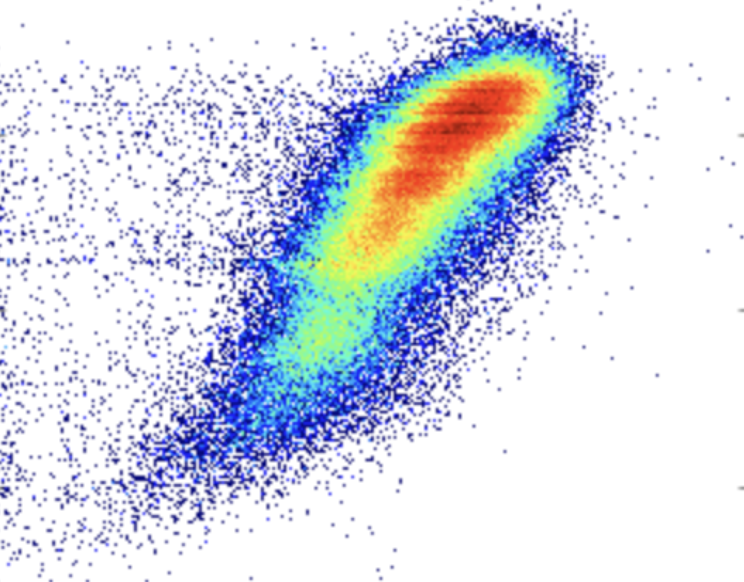

# From Python to TypeScript: My Journey with TypeScript and Athletic Software Engineering

## Can TypeScript be utalized in astrophysics?

I started my computer science degree to support my degree in astrophysics, so I had no prior TypeScript experience. My experience so far has been mostly in Python and LaTeX, so I feel more comfortable with TypeScript than I do with languages such as Java or C++. One reason I enjoy using Python is how, at times, it feels like you're just typing in English, and I got a very similar feeling to that with TypeScript. So overall, I enjoyed learning the tool! I think from a software engineering perspective, TypeScript is a great tool to utilize! It seems very reliable in catching bugs, and since it works with JavaScript, it can be easily adapted into projects that use JavaScript.

In the future, I don’t envision myself using TypeScript in the astrophysics field since it’s dominated by Python and C++ because of the amount of data processing and numerical computation. However, I could see it being used for tasks outside of research. I realized TypeScript could be used for creating platforms for researchers to collaborate on a project and to visualize larger datasets.

## How athletic software enginnering helps me!

Athletic software engineering is a way of teaching that uses timed coding practice, quick feedback, and teamwork to build our skills and confidence. This is something fairly new to me in the academic setting, but as a previous athlete, this is something I feel very comfortable with. When given a time limit, I feel more focused and more determined to complete something. It also further encourages me to practice in my free time and prepare for real-world situations. I also find the immediate feedback beneficial to my learning and progress as I'm able to evaluate my own skills and make note of my errors while everything is fresh on my mind. The only downside would be the stress of it. I find when the timer is counting down or I don't know where to start on a project, I lose some time scrambling. But I believe this is only something I struggle with currently, and as I improve and continue practicing, I will learn how to quickly move past the stress and work efficiently, which I believe is a good skill to have. I'm very excited for how this course is set up and believe it will very rapidly increase what I take from this class, and I'd encourage anyone who hasn't considered this method to give it a try!

Note: This essay was reviewed using AI tools for spelling and grammar corrections.

