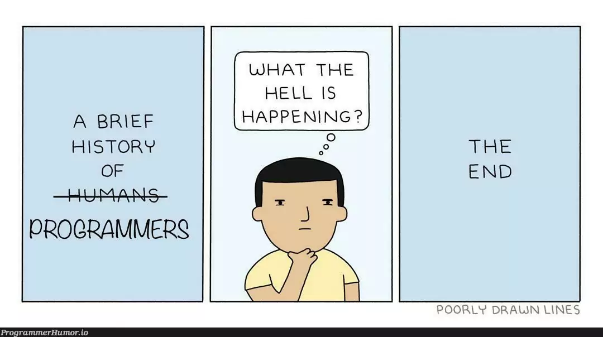

Asking questions the smart way is an important skill for software engineers because it helps us get better answers and faster responses. Eric Raymond explains how being clear, doing research beforehand, and providing enough details can make a big difference when asking technical questions. On Stack Overflow, questions that are formatted better tend to get more helpful responses, whereas quick or confusing questions might get ignored or downvoted.

Raymond’s explained the smart question got better advice by including clear details, showing their previous attempts, and explaining what the problem was in as much detail. For example, a user asked about why certain random strings produce colors when used as a background in HTML. They included code examples and explained their thought process, which helped others understand the issue quickly. As a result, the responses were helpful and directly answered the question. This question received upvotes, showing that it was a good example of how to ask effective questions.

### Example of a Smart Question:
**Question:** "Why is my Python function returning None instead of the expected value?"

```python
# I am trying to return the square of a number, but my function prints None. What am I doing wrong?
def square(num):
    print(num * num)  # I expect this to return a value

result = square(5)
print(result)  # Expected output: 25, but I get None instead
```

**Why this is smart:** The question includes an explanation of the issue, a code example, expected output, and what happened instead. This let others to quickly find the issue and provide help.

### Example of a Not Smart Question:
**Question:** "My Python code is broken. Help?"

```python
def something():
    x = 10
    y = 20
    z = x + y
```

**Why this is not smart:** The question doesn't include context, details, expected output, or even an error message. It doesn't explain what the user is trying to gain or what issue they are facing, making it difficult for others to provide help. The "not smart" question lacked context and clarity. By not providing more information or clarity, responses generally are made up by people requesting clarification, and then the post eventually gets closed without any solution to the problem. This shows how vague questions often lead to confusion, more follow up questions, and less productivity.

From this exercise, I know that asking smart questions leads to better help and a more positive experience on Stack Overflow and in day to day life/ class as well. If I take the time to structure my question clearly, I know I can get better responses. This experience made me more aware of how important communication is in programming.

<p style="text-align: center; font-size: 0.8em;">
Note: This essay was reviewed using AI tools for structure and grammar corrections.
</p>


