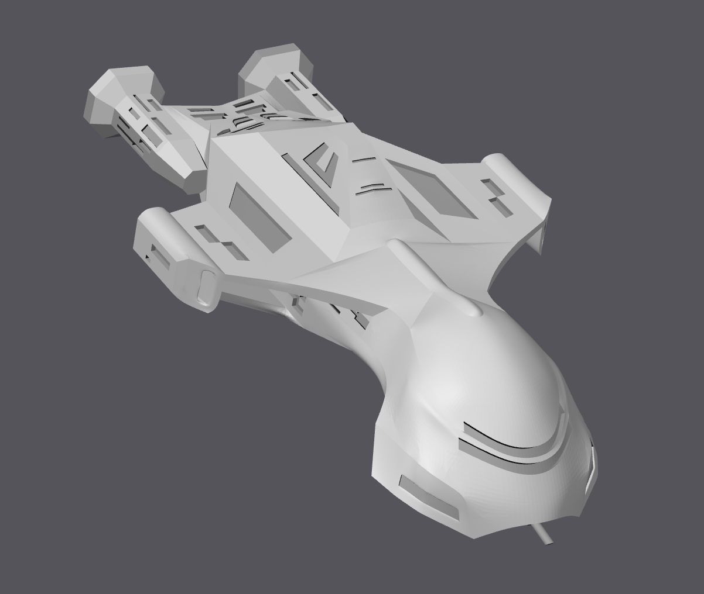

Starfleet Deluxe is a project I've been working on with a team for 8 months now. Originally I was assisting in upgrading the original Starfleet into its new version to be released soon. 6 months ago I was moved to lead the 3D model and design process for the Kickstarter. As of January 2024, we've completed 8 models and have begun manufacutring and 3D printing them to prepare for the Kickstarter launch. Now, I manage interns who join my project and help them improve their own 3D modeling skills. 

Each model takes around a month to complete and then an additional month for testing and small edits. Per university policy, interns are only able to work 20 hours per week, my schedule being 10 hours per week which delays the progress. However, product start to finish takes around two months. Below is one of the completed STL files.

On occasion, I assist with the iCosmos team on various projects to help improve the program, mostly working with the Mission Operations Support Tool (MOST). (https://www.interstel.tech/)
